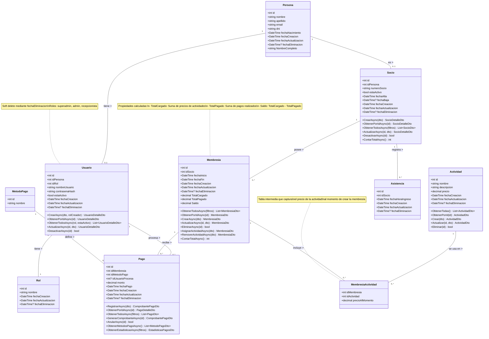

# Diagrama de Clases - Sistema de Gestión de Club

```mermaid
classDiagram
    direction TB

    class Rol {
        +int id
        +string nombre
        +DateTime fechaCreacion
        +DateTime fechaActualizacion
        +DateTime? fechaEliminacion
    }

    class Persona {
        +int id
        +string nombre
        +string apellido
        +string email
        +string dni
        +DateTime fechaNacimiento
        +DateTime fechaCreacion
        +DateTime fechaActualizacion
        +DateTime? fechaEliminacion
        +string NombreCompleto
    }

    class Usuario {
        +int id
        +int idPersona
        +int idRol
        +string nombreUsuario
        +string contrasenaHash
        +bool estaActivo
        +DateTime fechaCreacion
        +DateTime fechaActualizacion
        +DateTime? fechaEliminacion
        +CrearAsync(dto, rolCreador) UsuarioDetalleDto
        +ObtenerPorIdAsync(id) UsuarioDetalleDto
        +ObtenerTodosAsync(rol, estaActivo) List~UsuarioDetalleDto~
        +ActualizarAsync(id, dto) UsuarioDetalleDto
        +DesactivarAsync(id) bool
    }

    class Socio {
        +int id
        +int idPersona
        +string numeroSocio
        +bool estaActivo
        +DateTime fechaAlta
        +DateTime? fechaBaja
        +DateTime fechaCreacion
        +DateTime fechaActualizacion
        +DateTime? fechaEliminacion
        +CrearAsync(dto) SocioDetalleDto
        +ObtenerPorIdAsync(id) SocioDetalleDto
        +ObtenerTodosAsync(filtros) List~SocioDto~
        +ActualizarAsync(id, dto) SocioDetalleDto
        +DesactivarAsync(id) bool
        +ContarTotalAsync() int
    }

    class MetodoPago {
        +int id
        +string nombre
    }

    class Actividad {
        +int id
        +string nombre
        +string descripcion
        +decimal precio
        +DateTime fechaCreacion
        +DateTime fechaActualizacion
        +DateTime? fechaEliminacion
        +ObtenerTodas() List~ActividadDto~
        +ObtenerPorId(id) ActividadDto
        +Crear(dto) ActividadDto
        +Actualizar(id, dto) ActividadDto
        +Eliminar(id) bool
    }

    class Membresia {
        +int id
        +int idSocio
        +DateTime fechaInicio
        +DateTime fechaFin
        +DateTime fechaCreacion
        +DateTime fechaActualizacion
        +DateTime? fechaEliminacion
        +decimal TotalCargado
        +decimal TotalPagado
        +decimal Saldo
        +ObtenerTodosAsync(filtros) List~MembresiaDto~
        +ObtenerPorIdAsync(id) MembresiaDto
        +CrearAsync(dto) MembresiaDto
        +ActualizarAsync(id, dto) MembresiaDto
        +EliminarAsync(id) bool
        +AsignarActividadAsync(dto) MembresiaDto
        +RemoverActividadAsync(dto) MembresiaDto
        +ContarTotalAsync() int
    }

    class MembresiaActividad {
        +int idMembresia
        +int idActividad
        +decimal precioAlMomento
    }

    class Pago {
        +int id
        +int idMembresia
        +int idMetodoPago
        +int? idUsuarioProcesa
        +decimal monto
        +DateTime fechaPago
        +DateTime fechaCreacion
        +DateTime fechaActualizacion
        +DateTime? fechaEliminacion
        +RegistrarAsync(dto) ComprobantePagoDto
        +ObtenerPorIdAsync(id) PagoDetalleDto
        +ObtenerTodosAsync(filtros) List~PagoDto~
        +GenerarComprobanteAsync(id) ComprobantePagoDto
        +AnularAsync(id) bool
        +ObtenerMetodosPagoAsync() List~MetodoPagoDto~
        +ObtenerEstadisticasAsync(filtros) EstadisticasPagosDto
    }

    class Asistencia {
        +int id
        +int idSocio
        +DateTime fechaHoraIngreso
        +DateTime fechaCreacion
        +DateTime fechaActualizacion
        +DateTime? fechaEliminacion
    }

    %% Relaciones
    Persona "1" -- "0..1" Usuario : tiene >
    Persona "1" -- "0..1" Socio : es >
    Usuario "n" -- "1" Rol : tiene >
    Socio "1" -- "0..*" Membresia : posee >
    MetodoPago "1" -- "0..*" Pago : define >
    Membresia "1" -- "0..*" MembresiaActividad : incluye >
    Actividad "1" -- "0..*" MembresiaActividad : se usa en >
    Membresia "1" -- "0..*" Pago : recibe >
    Usuario "1" -- "0..*" Pago : procesa >
    Socio "1" -- "0..*" Asistencia : registra >

    note for Membresia "Propiedades calculadas:\n- TotalCargado: Suma de precios de actividades\n- TotalPagado: Suma de pagos realizados\n- Saldo: TotalCargado - TotalPagado"
    note for MembresiaActividad "Tabla intermedia que captura\nel precio de la actividad\nal momento de crear la membresía"
    note for Usuario "Soft delete mediante fechaEliminacion\nRoles: superadmin, admin, recepcionista"
```
